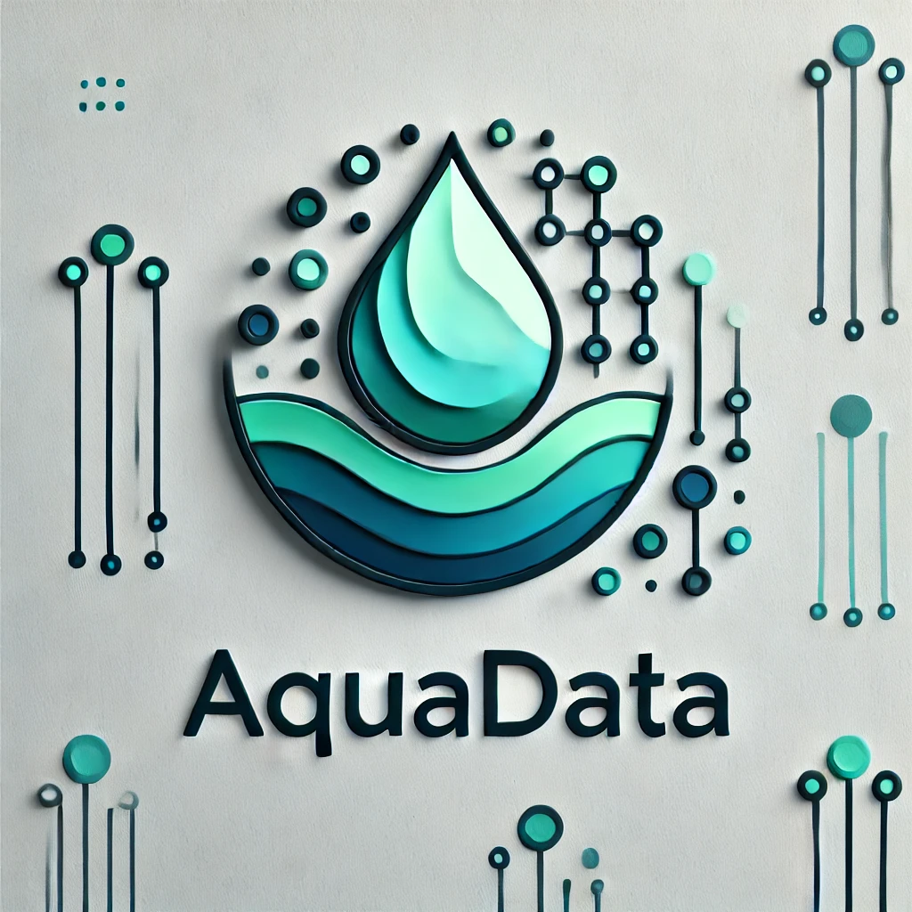

# Aquadata

## Instruções de execução
### Com DOCKER:
Instruções de execução: https://www.youtube.com/watch?v=HYpN88ZiOu4
1. Clone o repositório
2. Baixe o arquivo .env de exemplo disponível em (https://drive.google.com/file/d/1drbpzHw3ARpfVN37o3vr0sr7QFLwQFRd/view?usp=sharing); OBS: Certifique-se que o arquivo se chama ".env". Copie o arquivo para a raíz do projeto clonado.
3. Na raiz do diretório, execute o comando `docker compose up`
4. Uma vez que os containers do projeto estão rodando, basta acessar `localhost:5000` com qualquer navegador

- Demonstração de uso: https://www.youtube.com/watch?v=rc3ZyjfrY1c
